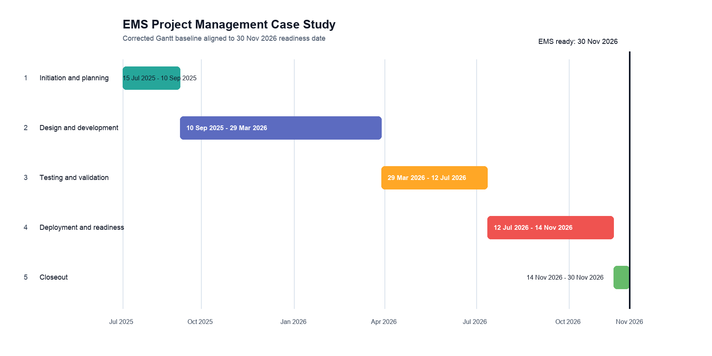
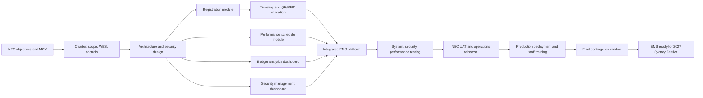

# EMS

Project Management case study for planning an Event Management System (EMS) for the 2027 Sydney Festival.

## Scenario

Nouveau Event Creations (NEC), a subsidiary of Recreation Amalgamated Holdings (RAH), needs an integrated EMS to operate the 2027 Sydney Festival. In this academic scenario, Project Management Professionals Pty Ltd (PMP) plans the project for NEC. The EMS scope integrates registration, ticketing, performance scheduling, budget analysis, security management, vendor coordination, and operational reporting.

This repository presents the project as a project-management case study. It does not claim that the EMS was commissioned, built, or deployed for a real client.

## My Work

I worked from the PMP project-planning perspective and focused on turning the scenario into a coherent delivery plan:

- Defined the project scope around registration, ticketing, artist scheduling, budget analytics, security monitoring, vendor workflows, and NEC administrative reporting.
- Coordinated the WBS, AON dependency logic, Gantt baseline, milestones, risks, budget assumptions, resource roles, communication approach, and quality controls.
- Reviewed the original project outputs and corrected schedule/WBS inconsistencies before making the portfolio version public.
- Rebuilt the public-facing schedule so the plan aligns with the report constraint: EMS readiness by 30 November 2026, ahead of the 2027 Sydney Festival.
- Reviewed the original artifacts locally for traceability while adding corrected, recruiter-readable outputs.

## Corrected Planning Baseline

| Item | Value |
| --- | --- |
| Project | Event Management System for NEC |
| Case-study role | Project Management Professionals Pty Ltd (PMP) |
| Delivery window | 2025-07-15 to 2026-11-30 |
| Required readiness date | 2026-11-30 |
| Corrected activity rows | 29 tasks and 5 milestones |
| Budget constraint | AUD 1.5 million |
| Primary deliverables | WBS, AON, Gantt baseline, risk/quality/change planning, stakeholder and communication planning |

## AON Logic

## Artifact Map

| Path | Purpose |
| --- | --- |
| `corrected/EMS_corrected_WBS_and_Gantt.xlsx` | Clean corrected workbook containing the WBS summary, corrected schedule, and validation notes. |
| `corrected/EMS_corrected_schedule.csv` | Recruiter-readable corrected Gantt source data. |
| `corrected/EMS_recovered_original_WBS.csv` | Recovered rows from the original WBS workbook for traceability. |
| `corrected/EMS_validation_report.md` | Detailed validation notes explaining what was fixed and why. |
| `assets/ems_gantt_preview.png` | Portfolio/GitHub visual showing the corrected phase-level Gantt. |
| `original-artifacts/` | Local-only source review folder. It is intentionally excluded from GitHub because the original report may contain assignment coversheet and jointly authored student details. |

## Validation Notes

- Original report states the EMS should be ready by 30 November 2026, but the original detailed Gantt extended to 2028-04-25. The corrected baseline finishes on 2026-11-30.
- Original milestone rows used positive durations. The corrected schedule uses 0-day milestone rows.
- Original WBS workbook stored data in the package, but common workbook readers could not expose the sheet because of strict OOXML metadata. The recovered CSV and corrected workbook make the WBS readable.
- Duplicate activity wording in the source schedule was rewritten into distinct deliverable-based activities.

## Skills Demonstrated

Project planning, WBS structuring, AON dependency analysis, Gantt scheduling, milestone governance, stakeholder planning, communication planning, risk management, quality management, resource planning, budget constraint management, Excel-based project controls, and case-study documentation.
